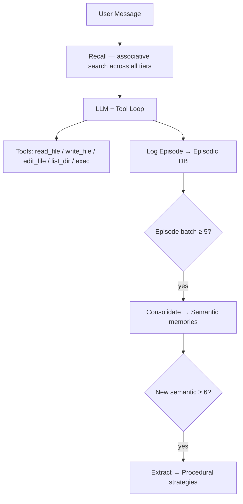

# 🐈 nanobot-lite

> A lightweight local AI agent with Progressive Memory Consolidation (PMC) — three-tier long-term memory backed by SQLite, Ebbinghaus-inspired decay, and LLM-driven consolidation.

---

## Table of Contents

- [Overview](#overview)
- [Architecture](#architecture)
- [Prerequisites](#prerequisites)
- [Repository Structure](#repository-structure)
- [Installation](#installation)
- [Configuration](#configuration)
- [Usage](#usage)
  - [CLI Quick Reference](#cli-quick-reference)
  - [Interactive Chat](#interactive-chat)
  - [Python API](#python-api)
- [Memory System](#memory-system)
- [PMC Memory Benchmark v2.0](#pmc-memory-benchmark-v20)
- [FAQ](#faq)
- [License & Citation](#license--citation)

---

## Overview

**nanobot-lite** is a minimal agent framework built around the idea that a useful AI assistant should *remember* things across sessions. It implements **Progressive Memory Consolidation (PMC)** — a three-tier memory architecture inspired by cognitive science:

- Raw interactions are stored as **Episodic** memories and decay quickly
- Stable facts are distilled into **Semantic** memories via LLM consolidation
- Reusable strategies are promoted into **Procedural** memories

All state is persisted in a local SQLite database (`~/.nanobot/memory/pmc.db`). No external database service required.

---

## Architecture



### Memory Decay (Ebbinghaus-inspired)

| Tier | Decay coefficient | Survives without access |
|------|------------------|-----------------------|
| Episodic | 0.30 (fast) | ~1–2 days — pushes toward consolidation |
| Semantic | 0.01 (slow) | Months, longer when reinforced |
| Procedural | 0.01 (slowest) | Most stable — learned strategies persist |

---

## Prerequisites

- Python ≥ 3.10 (3.11 recommended)
- An **OpenAI-compatible** LLM endpoint (chat + embeddings). Two common options:
  - **[DashScope](https://www.aliyun.com/product/bailian)** — default, pre-configured for `qwen3.5-plus`
  - **[vLLM](https://docs.vllm.ai/en/latest/serving/openai_compatible_server.html)** — for self-hosted GPU inference

---

## Repository Structure

```
nanobot/
├── __init__.py              # version = "0.1.0", logo = 🐈
├── __main__.py
├── cli.py                   # typer CLI: onboard / chat / status
├── config/
│   └── __init__.py          # Config model + load_config() / save_config()
├── agent/
│   ├── __init__.py          # LocalLLMProvider
│   ├── loop.py              # AgentLoop — recall → LLM → tools → log → consolidate
│   └── tools/
│       ├── filesystem.py    # read_file, write_file, edit_file, list_dir
│       └── shell.py         # exec
├── memory/
│   ├── __init__.py          # PMCMemory facade
│   ├── models.py            # EpisodicMemory, SemanticMemory, ProceduralMemory
│   ├── store.py             # SQLite persistence (MemoryStore)
│   ├── consolidator.py      # LLM-driven Episodic→Semantic→Procedural pipeline
│   └── recall.py            # Associative keyword recall (Recall)
├── session/
│   └── __init__.py          # SessionManager — JSONL conversation history
├── utils/
│   └── __init__.py
└── requirements.txt
```

---

## Installation

```bash
# Create and activate a virtual environment
python -m venv .venv
source .venv/bin/activate        # Windows: .venv\Scripts\activate

# Install dependencies
pip install -r nanobot/requirements.txt
```

Dependencies: `httpx`, `rich`, `typer`, `pydantic`, `pydantic-settings`

```bash
# Verify
python -m nanobot --help
```

---

## Configuration

Initialize the workspace and config file:

```bash
python -m nanobot onboard
```

This creates:
- `~/.nanobot/config.json` — model and API settings
- `~/.nanobot/workspace/` — working directory for file tools
- `~/.nanobot/workspace/AGENTS.md` — agent instructions template
- `~/.nanobot/workspace/memory/MEMORY.md` — legacy memory file

Edit `~/.nanobot/config.json` to point at your LLM service:

```json
{
  "model": "qwen3.5-plus",
  "apiBase": "https://coding-intl.dashscope.aliyuncs.com/v1",
  "apiKey": "YOUR_API_KEY",
  "workspace": "~/.nanobot/workspace",
  "maxIterations": 20,
  "temperature": 0.7,
  "maxTokens": 4500
}
```

> ⚠️ Never commit your real API key. Add `~/.nanobot/config.json` to `.gitignore` or use an environment variable.

The agent requires `POST /v1/chat/completions` for all LLM calls (consolidation, summarization, and chat). No embeddings endpoint is needed — recall is keyword-based.

---

## Usage

### CLI Quick Reference

```bash
# Initialize (run once)
python -m nanobot onboard

# Check API connectivity and workspace status
python -m nanobot status

# Start interactive chat (default session)
python -m nanobot chat

# Single-shot message — useful for scripting
python -m nanobot chat --message "What was the last thing we worked on?"

# Named session — keeps conversation history separate
python -m nanobot chat --session research

# Override model for one session
python -m nanobot chat --model qwen-max
```

### Interactive Chat

Once inside the interactive TUI, use these slash commands:

| Command | Description |
|---------|-------------|
| `/help` | Show all commands |
| `/clear` | Clear current session history |
| `/tools` | List available tools |
| `/status` | Show model and workspace info |
| `/memory` | Display PMC memory stats (counts, top semantic & procedural) |
| `/recall <query>` | Test associative recall for a query |
| `/quit` or `/exit` | Exit |

### Python API

```python
import asyncio
from pathlib import Path
from nanobot.config import load_config
from nanobot.agent import LocalLLMProvider
from nanobot.agent.loop import AgentLoop

async def main():
    cfg = load_config()
    provider = LocalLLMProvider(
        api_base=cfg.api_base,
        api_key=cfg.api_key,
        model=cfg.model,
        timeout=120.0,
    )
    agent = AgentLoop(
        provider=provider,
        workspace=cfg.workspace_path,
        max_iterations=cfg.max_iterations,
        temperature=cfg.temperature,
        max_tokens=cfg.max_tokens,
    )

    session = "demo"
    print(await agent.process("My cat's name is Mochi.", session_key=session))
    print(await agent.process("What is my cat's name?", session_key=session))

asyncio.run(main())
```

You can also interact with the memory system directly:

```python
from nanobot.memory import PMCMemory
from nanobot.memory.recall import Recall

pmc = PMCMemory(db_path="~/.nanobot/memory/pmc.db")

# Inspect memory stats
print(pmc.stats())
# {'episodic': 42, 'unconsolidated_episodes': 3, 'semantic': 17,
#  'active_semantic': 15, 'procedural': 4, 'active_procedural': 4}

# Test recall
result = pmc.recall("What does the user prefer for lunch?")
print(result.format_for_prompt())
```

---

## Memory System

### Three-Tier Architecture

**Episodic** — raw interaction traces  
Each agent turn is summarized by the LLM and stored with a query, summary, outcome (`success` / `neutral` / `failure`), and tags. Episodes decay fast (coefficient 0.30) to pressure the system toward consolidation.

**Semantic** — distilled factual knowledge  
When 5+ unconsolidated episodes accumulate, the consolidator calls the LLM to extract stable facts (e.g., `"The user's cat is named Mochi, a Scottish Fold"`). Duplicate detection uses token overlap (threshold 0.60); near-duplicates reinforce existing memories instead of creating new ones.

**Procedural** — reusable strategies  
When 6+ new semantic memories have been created, the consolidator extracts action strategies in `When <trigger> → Do <action>` form. Duplicate threshold: 0.50.

### Recall

`Recall.recall(query)` searches across all three tiers simultaneously:
- Tokenizes the query (supports numbers, alphanumeric combos like `72b`, `v2`)
- Scores each memory by `(relevance, strength)` — relevance dominates, strength breaks ties
- Returns up to 10 episodic, 10 semantic, 5 procedural results (any `rel > 0` qualifies)
- Touching a recalled memory resets its `last_accessed` timestamp, resetting decay

The `RecallResult` is formatted into a structured block injected into the LLM system prompt before each turn.

---
---

## FAQ

**Why can't the probe `"What is my cat's name?"` be recalled after just a few turns?**  
The answer lives in Semantic memory (e.g., `"The user's cat is Mochi"`). With fewer than 5 unconsolidated episodes, consolidation hasn't run yet. Either wait for more turns, lower `episode_batch_size` in `Consolidator`, or use the offline baseline to seed Semantic directly from `facts_introduced`.

**`status` says it cannot connect to the model service.**  
By default nanobot hits `GET {apiBase}/models`. DashScope supports this endpoint; local vLLM does too. If your provider doesn't implement it, the connectivity check will fail but chat will still work — just ignore the warning.

**SQLite locking errors during batch ingestion.**  
`MemoryStore` uses a single SQLite connection. Run ingestion in a single process, and use separate `.db` files for different experiments.

**How do I use a local model instead of DashScope?**  
Start a vLLM server and update `config.json`:

```json
{
  "model": "Qwen/Qwen2.5-72B-Instruct",
  "apiBase": "http://localhost:8000/v1",
  "apiKey": "token-abc123"
}
```

